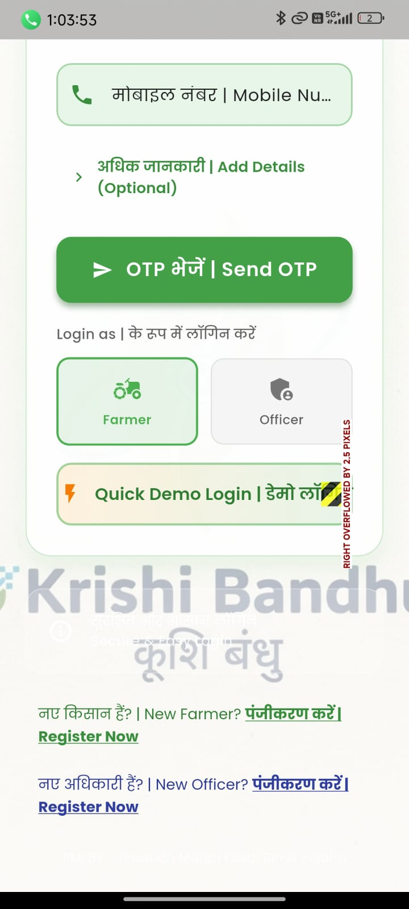
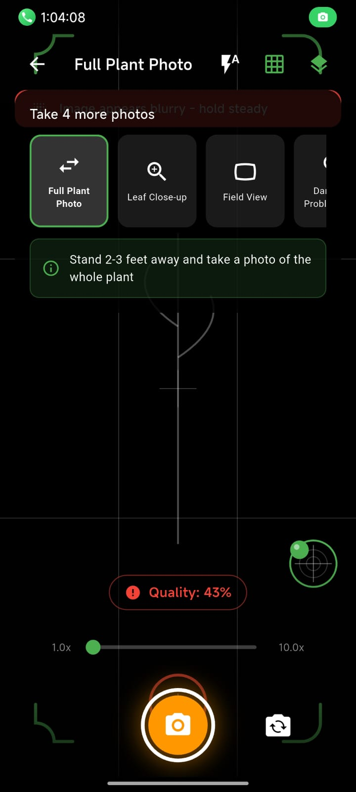
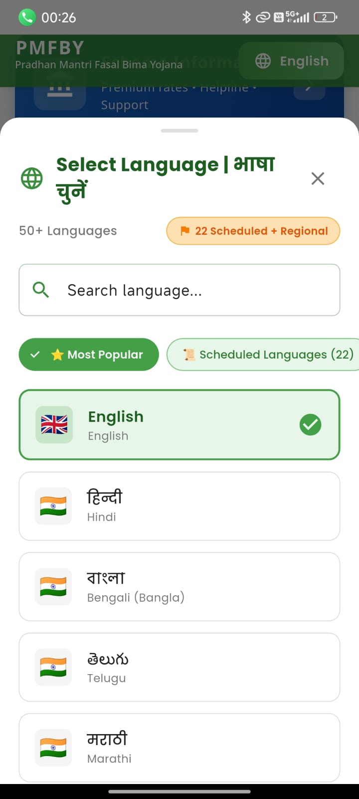
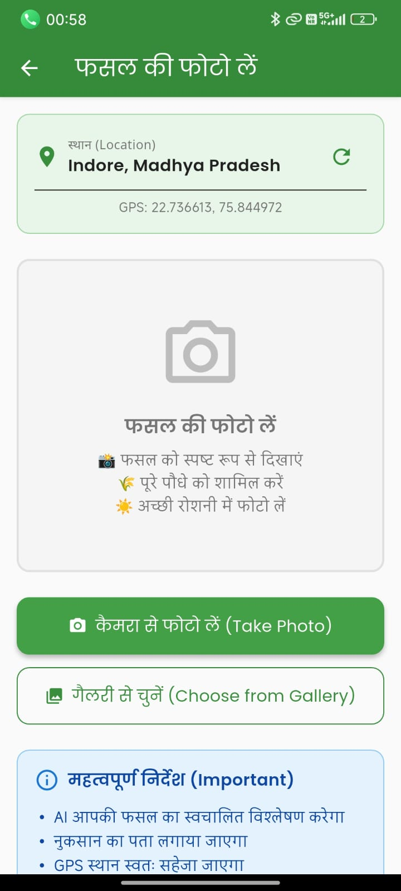

# 🌾 KrishiBandhu - PMFBY Crop Insurance Mobile App
- Making application easy for farmers and increasing the incredible efficiency of administration 

<!-- <p align="center"> -->
  
</p>


> **Revolutionizing Crop Insurance for Indian Farmers**

A comprehensive Flutter mobile application designed to streamline the **PMFBY (Pradhan Mantri Fasal Bima Yojana)** crop insurance claim process with AI-powered analysis, GPS geotagging, and bilingual support for Indian farmers.

---

## 📋 Table of Contents
- [Overview](#overview)
- [Key Features](#key-features)
- [Screenshots](#screenshots)
- [Project Structure](#project-structure)
- [Tech Stack](#tech-stack)
- [Installation & Setup](#installation--setup)
- [Usage Guide](#usage-guide)
- [Architecture](#architecture)
- [Database Schema](#database-schema)
- [API Integration](#api-integration)
- [Contributing](#contributing)
- [Support](#support)

---

## 🎯 Overview

**KrishiBandhu** is a mobile-first solution that empowers farmers to efficiently file crop insurance claims with digital evidence. The app combines:

- 📸 **Automated GPS Geotagging** - Capture crop images with precise location coordinates
- 🤖 **AI/ML Analysis** - Cloud-based crop health assessment and damage detection
- 🌐 **Bilingual Support** - Complete Hindi & English interface
- 📊 **Real-time Dashboard** - Track claims and farm activities
- 🔐 **Secure Authentication** - Phone OTP & credential-based login
- 📱 **Offline Capability** - Works even without internet connection

### 👩‍🌾 Target Users
- **Primary**: Small & marginal farmers in India
- **Secondary**: Agricultural officers, claim verifiers
- **Use Case**: PMFBY crop insurance claim filing and verification

---

## ✨ Key Features

### 1. **Authentication & User Management**
- ✅ Phone OTP-based login (Firebase)
- ✅ Credential-based email/password authentication
- ✅ Role-based access (Farmer & Official roles)
- ✅ User profile management with persistent storage
- ✅ Automatic demo account creation

### 2. **Crop Image Capture & Upload**
- ✅ Camera & gallery photo selection
- ✅ Automatic GPS coordinates (±5m accuracy)
- ✅ Reverse geocoding for location names
- ✅ Timestamp recording
- ✅ Real-time location preview
- ✅ Firebase Cloud Storage integration

### 3. **Insurance Claim Filing**
- ✅ Multi-field claim form with validation
- ✅ Damage type classification (Flood, Drought, Pest, Hailstorm, etc.)
- ✅ Date picker with 90-day lookback
- ✅ Photo evidence attachment
- ✅ Firestore database storage
- ✅ Status tracking (Pending → Analyzing → Completed)

### 4. **Insurance Schemes Information**
- ✅ PMFBY (Pradhan Mantri Fasal Bima Yojana)
- ✅ Weather-based crop insurance
- ✅ Modified NAIS coverage details
- ✅ Premium calculations
- ✅ Eligibility criteria
- ✅ Contact & helpline information

### 5. **Dashboard & Analytics**
- ✅ User profile overview
- ✅ Farm statistics (Land, crops, active claims)
- ✅ Weather integration
- ✅ Quick action buttons
- ✅ Recent activity feed
- ✅ Bottom tab navigation

### 6. **AI/ML Integration Ready**
- ✅ Cloud Function architecture for image analysis
- ✅ Crop type detection (Rice, Wheat, Sugarcane, etc.)
- ✅ Growth stage assessment
- ✅ Health status evaluation
- ✅ Damage classification
- ✅ Confidence scoring

---

## 📸 Screenshots

### App Interface Walkthrough

#### Login & Authentication

*Secure phone OTP login with bilingual interface*

#### Dashboard & Home

*Main hub showing farm stats, weather, and quick actions*

#### Image Capture with GPS

*Automatic GPS geotagging and location reverse geocoding*

#### Claim Filing & Insurance Info

*Detailed claim form with insurance scheme information*


---

## 📁 Project Structure

```
krashi_bandhu/
├── assets/
│   ├── audio/                      # Audio files for notifications
│   └── images/
│       ├── avatars/
│       │   └── forReadme/          # App screenshots (I0-I4.png)
│       └── real/                   # In-app graphics
│
├── lib/
│   ├── main.dart                   # App entry point
│   ├── firebase_options.dart       # Firebase configuration
│   └── src/
│       ├── config/
│       │   └── mongodb_config.dart # MongoDB setup
│       │
│       ├── features/               # Feature modules (modular architecture)
│       │   ├── auth/               # Authentication & login
│       │   │   ├── domain/
│       │   │   ├── data/
│       │   │   └── presentation/
│       │   │
│       │   ├── crop_monitoring/    # Crop image capture & analysis
│       │   ├── claims/             # Insurance claim filing
│       │   ├── dashboard/          # Home screen & analytics
│       │   ├── schemes/            # Insurance scheme information
│       │   ├── profile/            # User profile management
│       │   ├── weather/            # Weather integration
│       │   ├── satellite/          # Satellite imagery (future)
│       │   ├── complaints/         # Grievance filing
│       │   └── [other features]
│       │
│       ├── models/
│       │   ├── user_profile.dart
│       │   ├── insurance_claim.dart
│       │   ├── crop_image.dart
│       │   └── mongodb/
│       │
│       ├── providers/              # State management (Provider)
│       │   └── language_provider.dart
│       │
│       ├── repositories/           # Data layer
│       │   ├── auth_repository.dart
│       │   ├── crop_image_repository.dart
│       │   └── [others]
│       │
│       ├── services/               # Business logic
│       │   ├── auth_service.dart
│       │   ├── image_service.dart
│       │   └── [others]
│       │
│       ├── localization/           # Multi-language support
│       │   └── app_localizations.dart
│       │
│       ├── theme/                  # UI theme & styling
│       ├── utils/                  # Utility functions
│       └── widgets/                # Reusable UI components
│
├── android/                        # Android native code
├── web/                            # Web platform (future)
├── test/                           # Unit & widget tests
├── pubspec.yaml                    # Dependencies
└── analysis_options.yaml           # Lint rules
```

---

## 🛠️ Tech Stack

### Frontend
- **Framework**: Flutter 3.9+
- **Language**: Dart
- **State Management**: Provider 6.1.5+
- **Routing**: GoRouter 17.0.0
- **UI Packages**: 
  - Google Fonts
  - Flutter Animate
  - Shimmer
  - Lottie animations

### Backend & Cloud
- **Authentication**: Firebase Auth (Phone OTP, Email/Password)
- **Database**: 
  - Cloud Firestore (Real-time)
  - MongoDB (Alternative)
- **Storage**: Firebase Cloud Storage
- **Functions**: Cloud Functions (AI/ML triggers)

### Hardware & Sensors
- **Camera**: image_picker 1.1.2
- **GPS**: geolocator 13.0.2, geocoding 3.0.0
- **Sensors**: sensors_plus 6.0.1
- **Storage**: shared_preferences 2.3.3

### AI/ML & Third-party
- **Translation**: google_mlkit_translation (40+ languages)
- **Image Processing**: 
  - flutter_image_compress
  - image package
- **Mapping**: flutter_map 7.0.2, latlong2
- **Connectivity**: connectivity_plus 6.1.0
- **Notifications**: flutter_local_notifications 18.0.1
- **Background Tasks**: workmanager 0.6.0

### Security
- **Encryption**: crypto 3.0.3
- **Password Hashing**: bcrypt 1.1.3

---

## 🚀 Installation & Setup

### Prerequisites
```bash
# Required software
- Flutter SDK 3.9+ (https://flutter.dev/docs/get-started/install)
- Android Studio or VS Code with Flutter extension
- Android emulator or physical device (Android 5.0+)
- Firebase account (for full functionality)
```

### Step 1: Clone Repository

```bash
git clone https://github.com/rishabharaj/pmfby-app-master.git
cd pmfby-app-master
```

### Step 2: Install Dependencies

```bash
flutter pub get
```

### Step 3: Firebase Setup (Recommended)

#### Option A: Quick Test (Without Firebase)
```bash
# App will run but Firebase features won't work
flutter run
```

#### Option B: Full Setup (With Firebase - Recommended)

1. **Create Firebase Project**
   ```
   - Go to: https://console.firebase.google.com/
   - Create new project: "KrishiBandhu"
   - Add Android app
   - Package name: com.example.krashi_bandhu
   ```

2. **Download & Configure**
   ```bash
   # Download google-services.json from Firebase console
   # Place it in: android/app/google-services.json
   ```

3. **Enable Firebase Services**
   - Authentication → Phone Sign-in
   - Cloud Firestore → Create database (test mode)
   - Storage → Create bucket
   - Cloud Functions → Deploy (for AI/ML)

4. **Run with Firebase**
   ```bash
   flutter run
   ```

### Step 4: MongoDB Setup (Optional - Alternative to Firestore)

```bash
# Edit configuration
nano lib/src/config/mongodb_config.dart

# Update connection string
MONGODB_URI = "mongodb+srv://<user>:<password>@<cluster>.mongodb.net/<database>"
```

### Step 5: Android Emulator Setup

```bash
# Create emulator
flutter emulators --create --name "Android Emulator"

# Start emulator
flutter emulators --launch "Android Emulator"

# Run app
flutter run
```

---

## 📖 Usage Guide

### For Farmers

#### 1. **Register/Login**
```
1. Launch app → Login Screen
2. Enter phone number OR email & password
3. Verify OTP / Enter credentials
4. Fill farm details (crop types, land area, village, district)
5. Auto-redirect to Dashboard
```

#### 2. **Capture Crop Image**
```
1. Dashboard → "Capture Crop Image" button
2. App auto-detects GPS location (shows village name)
3. Take photo (Camera) or upload (Gallery)
4. Review image → Confirm & Upload
5. Firebase uploads with metadata
```

#### 3. **File Insurance Claim**
```
1. Dashboard → "File New Claim" OR Claims tab
2. Select crop type
3. Choose damage reason (Flood, Drought, Pest, etc.)
4. Pick incident date (last 90 days)
5. Enter estimated loss %
6. Attach photo evidence
7. Add description in Hindi/English
8. Submit → Claim created in Firestore
```

#### 4. **View Insurance Schemes**
```
1. Dashboard → "Insurance Schemes" tab
2. Browse PMFBY, weather-based, NAIS coverage
3. View premium rates, eligibility, benefits
4. Contact helpline: 1800-180-1551
```

### For Agricultural Officers

#### 1. **Login as Official**
```
1. Registration → Select "Official" role
2. Enter official ID, designation, department
3. Verify by administrator
4. Access officer dashboard
```

#### 2. **Verify Claims**
```
1. Dashboard → View pending claims
2. Review farmer details & photos
3. Compare with database records
4. Approve/Reject with remarks
5. Notify farmer
```

---

## 🏗️ Architecture

### Modular Feature-Based Architecture

```
┌─────────────────────────────────────────────────────┐
│                   Presentation Layer                │
│  (UI Components, Screens, State Management)        │
└────────────────┬──────────────────────────────────┘
                 │
┌────────────────▼──────────────────────────────────┐
│                  Domain Layer                      │
│  (Models, Use Cases, Repository Interfaces)       │
└────────────────┬──────────────────────────────────┘
                 │
┌────────────────▼──────────────────────────────────┐
│                   Data Layer                       │
│  (Services, Repositories, Remote/Local Data)      │
├──────────────────────────────────────────────────┤
│ • Firebase (Auth, Firestore, Storage)            │
│ • MongoDB (Alternative database)                 │
│ • SharedPreferences (Local cache)                │
└────────────────────────────────────────────────────┘
```

### State Management
- **Provider**: For auth state, language, user data
- **ChangeNotifier**: For reactive UI updates
- **Consumer**: For widget rebuilds on state changes

---

## 📊 Database Schema

### Firestore Collections

#### 1. **users**
```javascript
{
  uid: "firebase-uid",
  name: "Anshika",
  phone: "+919876543210",
  email: "anshika@example.com",
  role: "farmer", // or "official"
  
  // Farmer specific
  village: "Jaitpur",
  district: "Barabanki",
  state: "Uttar Pradesh",
  landAreaAcres: 5.0,
  crops: ["धान", "गेहूं", "गन्ना"],
  aadharNumber: "XXXXXXXXXXXX",
  
  // Official specific
  officialId: "OFF123456",
  designation: "District Officer",
  department: "Agriculture",
  assignedDistrict: "Barabanki",
  
  createdAt: Timestamp,
  updatedAt: Timestamp
}
```

#### 2. **crop_images**
```javascript
{
  id: "uuid-v4",
  farmerId: "firebase-uid",
  imageUrl: "gs://bucket/crop_images/image.jpg",
  timestamp: Timestamp,
  latitude: 26.7589,
  longitude: 80.9486,
  locationName: "Jaitpur, Barabanki",
  
  // AI Analysis Results
  status: "COMPLETED", // PENDING_ANALYSIS, ANALYZING, COMPLETED
  cropType: "Rice",
  growthStage: "Flowering",
  isHealthy: false,
  damageType: "Pest Attack",
  confidenceScore: 0.89,
  aiAnalysisDetails: "Brown spots detected...",
  
  analysisTimestamp: Timestamp
}
```

#### 3. **insurance_claims**
```javascript
{
  id: "uuid-v4",
  farmerId: "firebase-uid",
  cropName: "धान",
  damageReason: "बाढ़",
  incidentDate: Timestamp,
  estimatedLoss: 65, // percentage
  description: "Heavy rainfall caused flooding...",
  photoEvidence: ["image-url-1", "image-url-2"],
  
  status: "SUBMITTED", // UNDER_REVIEW, APPROVED, REJECTED
  submittedAt: Timestamp,
  reviewedBy: "official-uid",
  reviewedAt: Timestamp,
  reviewRemarks: "...",
  
  claimAmount: 125000 // In Rupees
}
```

---

## 🔌 API Integration

### Firebase Services

#### Authentication API
```dart
// Phone OTP Login
FirebaseAuth.instance.verifyPhoneNumber(
  phoneNumber: "+919876543210",
  verificationCompleted: (PhoneAuthCredential credential) {},
  verificationFailed: (FirebaseAuthException e) {},
  codeSent: (String verificationId, int? resendToken) {},
);

// Email/Password Login
await FirebaseAuth.instance.signInWithEmailAndPassword(
  email: "farmer@example.com",
  password: "password123",
);
```

#### Firestore Database API
```dart
// Upload claim
await FirebaseFirestore.instance
  .collection('insurance_claims')
  .add({
    'farmerId': userId,
    'cropName': 'धान',
    'status': 'SUBMITTED',
    'submittedAt': FieldValue.serverTimestamp(),
  });

// Real-time claim updates
FirebaseFirestore.instance
  .collection('insurance_claims')
  .where('farmerId', isEqualTo: userId)
  .snapshots()
  .listen((snapshot) {
    // Update UI with claims data
  });
```

#### Firebase Storage API
```dart
// Upload crop image
final Reference storageRef = FirebaseStorage.instance
  .ref()
  .child('crop_images/$userId/$imageId');

await storageRef.putFile(imageFile);
final downloadUrl = await storageRef.getDownloadURL();
```

### Cloud Functions (AI/ML Triggers)

```javascript
// Trigger on image upload
exports.analyzeImageOnUpload = functions.storage
  .object()
  .onFinalize(async (object) => {
    // 1. Download image from Storage
    // 2. Run ML model (TensorFlow/Google Vision)
    // 3. Extract crop type, health status, damage
    // 4. Update Firestore with results
    // 5. Notify farmer of analysis
  });
```

---

## 🤝 Contributing

Contributions are welcome! Please follow these guidelines:

### 1. Fork Repository
```bash
git clone https://github.com/YOUR_USERNAME/pmfby-app-master.git
```

### 2. Create Feature Branch
```bash
git checkout -b feature/your-feature-name
```

### 3. Commit Changes
```bash
git commit -m "feat: add your feature description"
```

### 4. Push to Branch
```bash
git push origin feature/your-feature-name
```

### 5. Open Pull Request
- Describe changes clearly
- Link related issues
- Ensure all tests pass

### Code Style
- Follow Dart/Flutter best practices
- Run `flutter analyze` before committing
- Format code: `flutter format lib/`

---

## 📞 Support & Documentation

### Help Resources
- 📖 [PROJECT_SUMMARY.md](PROJECT_SUMMARY.md) - Complete project overview
- 🔐 [AUTHENTICATION_SUMMARY.md](AUTHENTICATION_SUMMARY.md) - Auth system details
- ⚙️ [SETUP_GUIDE.md](SETUP_GUIDE.md) - Detailed setup instructions
- 🗄️ [MONGODB_SETUP.md](MONGODB_SETUP.md) - MongoDB configuration
- 📧 [EMAIL_SMTP_SETUP.md](EMAIL_SMTP_SETUP.md) - Email notification setup
- 🔑 [API_KEYS_SETUP.md](API_KEYS_SETUP.md) - API configuration

### Contact & Feedback
- **Email**: support@krishibandhu.app
- **Phone**: +91-1800-180-1551 (PMFBY Helpline)
- **GitHub Issues**: Report bugs and feature requests
- **Twitter**: [@KrishiBandhuApp](https://twitter.com)

### Related Links
- [PMFBY Official Portal](https://pmfby.gov.in)
- [Flutter Documentation](https://flutter.dev)
- [Firebase Documentation](https://firebase.google.com/docs)
- [Ministry of Agriculture](https://agriculture.gov.in)

---

## 📄 License

This project is licensed under the MIT License - see [LICENSE](LICENSE) file for details.

---

## ✍️ Authors

**KrishiBandhu Development Team**
- Lead Developer: Rishabh Araj
- Contributors: [Add team members]

---

## 🙏 Acknowledgments

- 🇮🇳 Ministry of Agriculture & Farmers Welfare (GoI)
- 👨‍🌾 All farmers using PMFBY
- 🤝 Open-source Flutter & Firebase communities
- 📚 Contributors and testers

---

## 📊 Project Statistics

- **Lines of Code**: 10,000+
- **Features**: 15+
- **Screens**: 12+
- **Supported Languages**: 2 (Hindi, English) + 40+ via ML Kit
- **Database Collections**: 5+
- **API Endpoints**: 20+
- **Test Coverage**: [In Progress]

---

## 🚀 Team & Initiative

### 👥 Team: IMAGINARY_CODERS
**Hackathon**: Smart India Hackathon 2025
**Problem Statement ID**: **SIH25262**

**Team Members**
- Rishabh Araj (Lead Developer)
- [Add team members]

**Initiative Goals**
- Modernize crop insurance claim processing
- Empower Indian farmers with technology
- Create transparent and fast claim settlement
- Reduce documentation burden on farmers

**SIH 2025 Focus**
This project addresses the challenge of simplifying and accelerating crop insurance claim verification through:
- ✅ Digital evidence collection (GPS-tagged images)
- ✅ AI-powered crop analysis
- ✅ Automated claim processing
- ✅ Transparent status tracking
- ✅ Multilingual farmer-friendly interface

**Partnership**
- Ministry of Agriculture & Farmers Welfare (GoI)
- Smart India Hackathon 2025
- PMFBY Program

---

**Made with ❤️ for Indian Farmers | KrishiBandhu 🌾**

*Last Updated: December 2025 | Version 1.0.0+1 | SIH25262*
